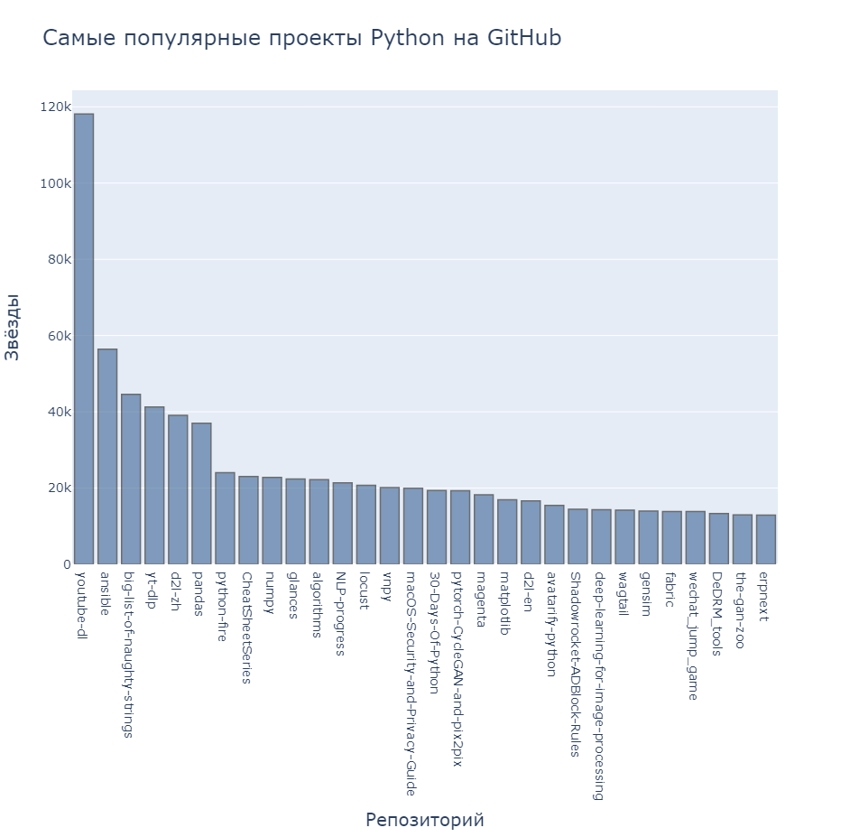
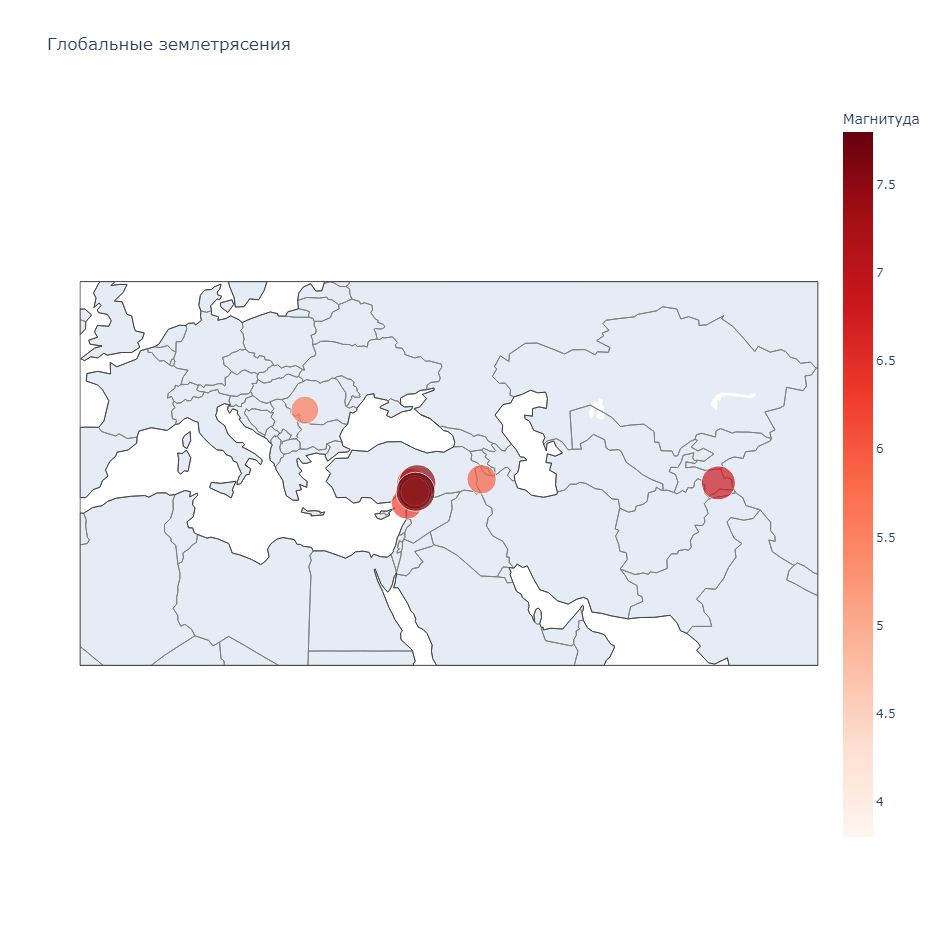
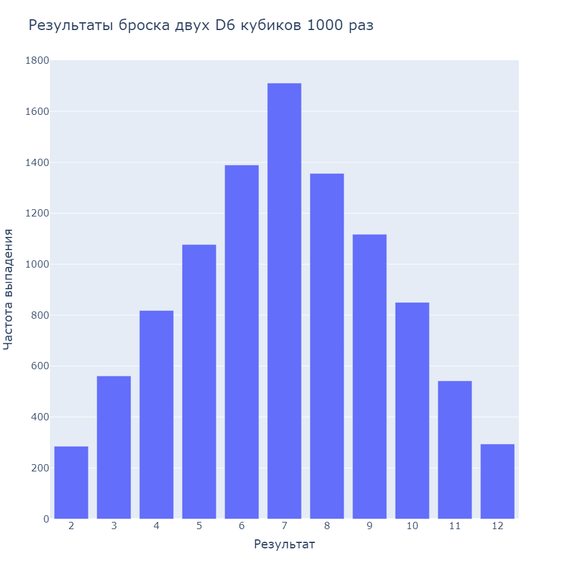
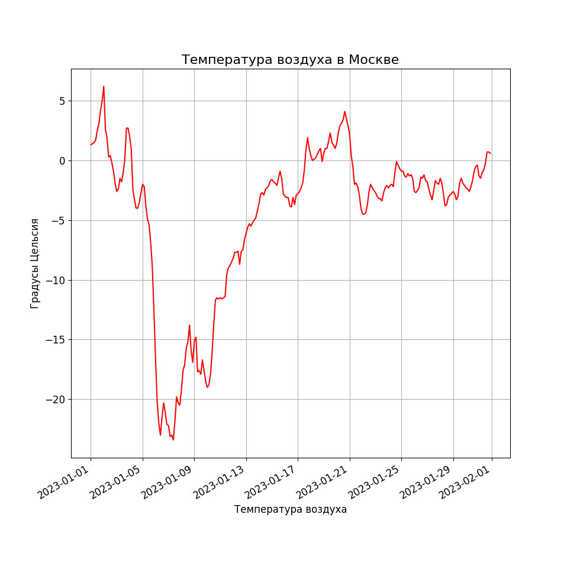

# DataVisualization

---
В данном репозитории представленные проекты с визуализацией данных из книги Python Crash Cours Эрика Мэтиза.

Цель данных проектов изучить библиотеку Plotly для визуализации данных в Python.

В данном репозитории реализовано:
* Построение графика на основе симуляции броска двух кубиков 10000 раз
* Построение графика температуры в Москве. Данные получены из csv-файла
* Визуализация карты с координатами землетрясений произошедших за последний месяц. Данные получены из csv-файла
* Построение графика самых популярных репозиториев на python в github. Данные получены из API


---
<p>
    
    
    
    
</p>

## Установка
1. Клонировать репозиторий
```
git clone https://github.com/Sogato/DataVisualization.git
```
2. Установить зависимости
```
pip install -r requirements.txt
```
